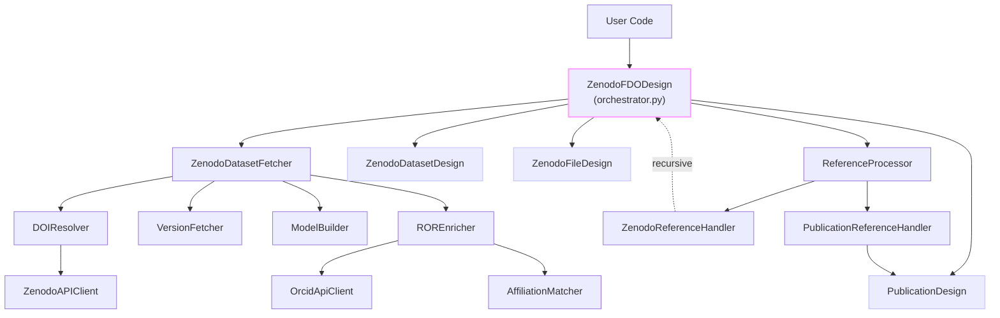
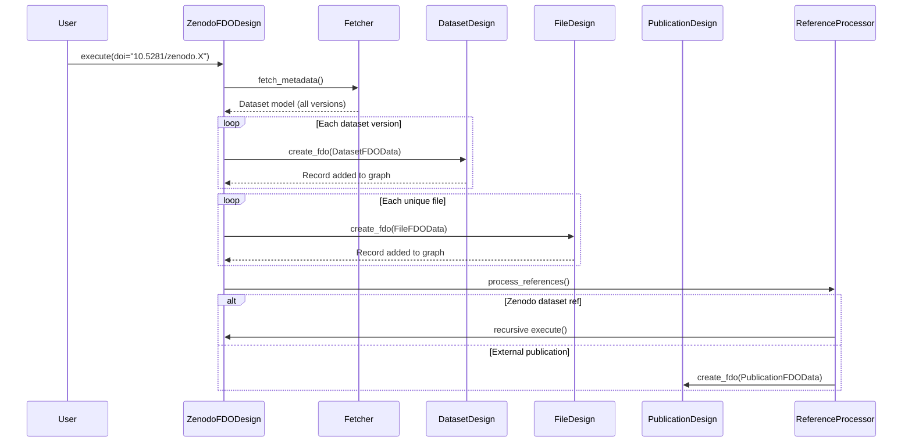

# Zenodo FDO Designs

Transforms Zenodo dataset metadata into FAIR Digital Objects (FDOs) with full version tracking, file deduplication, and creator enrichment.

## Subdesigns

| Design | Purpose | Profiles | Record ID |
|--------|---------|----------|-----------|
| **ZenodoDatasetDesign** | Creates Dataset FDOs for each Zenodo version | Base + Versionable | Version DOI (e.g., `10.5281/zenodo.20132712`) |
| **ZenodoFileDesign** | Creates File FDOs for unique files across versions | Base + DataResource + Versionable | MD5 checksum (e.g., `md5:abc123...`) |
| **PublicationDesign** | Creates Publication FDOs for external references | Base + Publication | DOI/identifier (e.g., `10.1016/j.actamat.2025.120735`) |

## Architecture



### Workflow



## Features

- **Multi-version support**: Handles all versions of a dataset with bidirectional navigation
- **File deduplication**: Single File FDO per unique checksum across all versions
- **Version chain tracking**: Links between consecutive dataset AND file versions
- **Creator enrichment**: ROR ID extraction from Zenodo export API + ORCID profile lookup
- **Nested reference handling**: Recursively processes referenced Zenodo datasets
- **Profile compliance**: Base + Versionable/DataResource/Publication profiles
- **Backlink inference**: Pre-defined backlink types for Executor-based relationship inference
- **Response caching**: Optional in-memory caching for API calls
- **HTML sanitization**: Strips HTML tags from descriptions, truncates to 500 words

## FDO Examples

### Input Exchange Models

#### DatasetFDOData
```python
DatasetFDOData(
    doi="10.5281/zenodo.20132712",
    title="Creep Reference Data v2",
    description="Dataset description (HTML stripped)",
    publication_date=date(2024, 6, 1),
    version_label="2.0",
    creators=[
        CreatorData(orcid="0000-0000-0000-0001", ror_id="https://ror.org/03x516a66"),
    ],
    keywords=["creep", "superalloy", "reference data"],
    previous_version_doi="10.5281/zenodo.111111",
    next_version_doi=None,
    latest_version_doi="10.5281/zenodo.20132712"
)
```

#### FileFDOData
```python
FileFDOData(
    checksum="md5:28573899cc09a145ac2c69fc1370c0bf",
    filename="data.csv",
    mimetype="text/csv",
    download_url="https://zenodo.org/api/records/1/files/data.csv",
    license_url="https://creativecommons.org/licenses/by/4.0/",
    previous_version_checksum=None,
    next_version_checksum="md5:abcdef1234567890..."
)
```

#### PublicationFDOData
```python
PublicationFDOData(
    identifier="10.1016/j.actamat.2025.120735",
    resource_type="publication-article",
    publisher="Elsevier",
    publication_date="2025-01-15",
    title="Creep reference data...",
    description="Abstract text",
    creator_orcids=["0000-0000-0000-0001"]
)
```

### Actual FDO Records (PidRecord Structure)

#### Dataset FDO Record
**Record ID:** `10.5281/zenodo.20132712`

| PID (Key) | Human-Readable Name | Value |
|-----------|---------------------|-------|
| `21.T11148/076759916209e5d62bd5` | **Profiles** | `["21.T11969/077fe9c54ed5ed26fa54", "21.T11969/6c663a0695a411803d70"]` |
| `21.T11969/bd3e9fb9b606d2198c9e` | **name** | `"Creep Reference Data v2"` |
| `21.T11969/880724416f5857987e70` | **description** | `"Dataset description (HTML stripped)"` |
| `21.T11969/29f92bd203dd3eaa5a1f` | **dateCreated** | `"2024-06-01"` |
| `21.T11969/7c67083a5d218e544063` | **creator** | `["0000-0000-0000-0001"]` |
| `21.T11969/ea9f6b3d78c6608fe801` | **creatorAffiliation** | `["https://ror.org/03x516a66"]` |
| `21.T11969/793ff5c33c3aeb32907a` | **keyword** | `["creep", "superalloy", "reference data"]` |
| `21.T11969/be1ae3492b235faad933` | **version** | `"2.0"` |
| `21.T11969/7c97f00a2a95826c1a8f` | **previousVersion** | `"10.5281/zenodo.111111"` |
| `21.T11969/2b4d6ceda80ddd63f7a9` | **latestVersion** | `"10.5281/zenodo.20132712"` |

**Backlinks:** `("hasData", "isPartOf")`, `("isNewVersionOf", "isPreviousVersionOf")`

---

#### File FDO Record
**Record ID:** `md5:28573899cc09a145ac2c69fc1370c0bf`

| PID (Key) | Human-Readable Name | Value |
|-----------|---------------------|-------|
| `21.T11148/076759916209e5d62bd5` | **Profiles** | `["21.T11969/077fe9c54ed5ed26fa54", "21.T11969/0738c2ef35faef0fb552", "21.T11969/6c663a0695a411803d70"]` |
| `21.T11969/bd3e9fb9b606d2198c9e` | **name** | `"data.csv"` |
| `21.T11969/3313b863118ed5eb0ded` | **mimeType** | `"text/csv"` |
| `21.T11969/479febb2bbe8400da547` | **dataObjectLocation** | `"https://zenodo.org/api/records/1/files/data.csv"` |
| `21.T11969/a80ed2ef79e22f1d8af8` | **checksum** | `"md5:28573899cc09a145ac2c69fc1370c0bf"` |
| `21.T11969/623654b1072ae7b88202` | **spdxLicense** | `"https://creativecommons.org/licenses/by/4.0/"` |
| `21.T11969/7f1a6afddcfeefbf195b` | **nextVersion** | `"md5:abcdef1234567890..."` |

**Backlinks:** `("hasData", "isPartOf")`, `("isNewVersionOf", "isPreviousVersionOf")`

---

#### Publication FDO Record
**Record ID:** `10.1016/j.actamat.2025.120735`

| PID (Key) | Human-Readable Name | Value |
|-----------|---------------------|-------|
| `21.T11148/076759916209e5d62bd5` | **Profiles** | `["21.T11969/077fe9c54ed5ed26fa54", "21.T11969/e00441c49bf6cb62a4a5"]` |
| `21.T11969/48e563f148dc04d8b31c` | **doi** | `"10.1016/j.actamat.2025.120735"` |
| `21.T11969/48dbf6a89f9748ae4ead` | **dataCitePublicationType** | `"publication-article"` |
| `21.T11969/cdd96207a7dfbcc0db93` | **publisher** | `"Elsevier"` |
| `21.T11969/0c9b86e828976a85d4f2` | **datePublished** | `"2025-01-15"` |
| `21.T11969/bd3e9fb9b606d2198c9e` | **name** | `"Creep reference data..."` |
| `21.T11969/880724416f5857987e70` | **description** | `"Abstract text"` |
| `21.T11969/7c67083a5d218e544063` | **creator** | `["0000-0000-0000-0001"]` |

**Backlinks:** `("cites", "isCitedBy")`, `("references", "isReferencedBy")`

## Usage Examples

### Basic Usage
```python
from fdo_usecases.designs.zenodo import ZenodoFDODesign
from fdo_usecases.designs.zenodo.logging_config import setup_logging
import logging

setup_logging(level=logging.INFO)

# Execute design for a Zenodo DOI
design = ZenodoFDODesign(doi="10.5281/zenodo.20132712")
design.execute()

# Access created records
for record_id, record in design._record_graph.items():
    print(f"Record: {record_id}")
    print(f"  Profiles: {record.getAttribute('21.T11148/076759916209e5d62bd5')}")
```

### Standalone Design Usage
```python
from datetime import date
from fdo_usecases.designs.zenodo.designs import ZenodoDatasetDesign
from fdo_usecases.designs.zenodo.models.exchange import DatasetFDOData, CreatorData

# Create design independently (without orchestrator)
design = ZenodoDatasetDesign()

data = DatasetFDOData(
    doi="10.5281/zenodo.123456",
    title="My Dataset",
    description="Dataset description",
    publication_date=date(2024, 1, 1),
    version_label="1.0",
    creators=[CreatorData(orcid="0000-0000-0000-0001")],
    keywords=["test"]
)

record_id = await design.create_fdo(data)
```

### Run Example Script
```bash
python -m fdo_usecases.designs.zenodo.scripts.run_design
```
