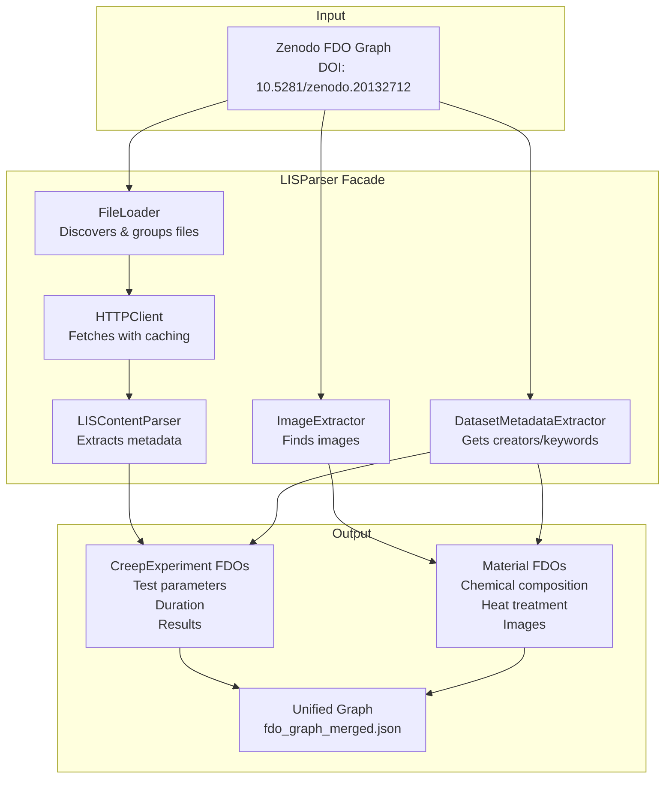
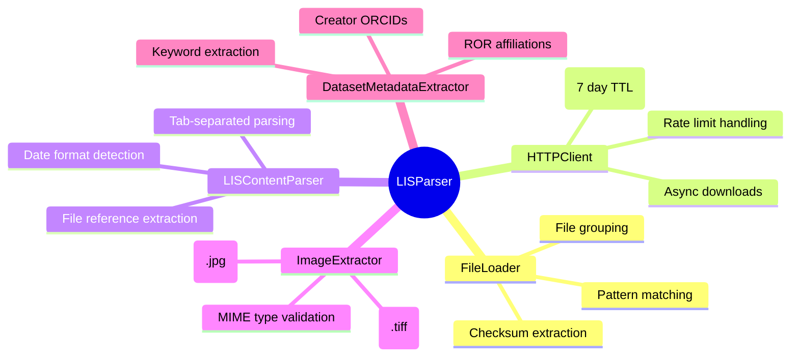
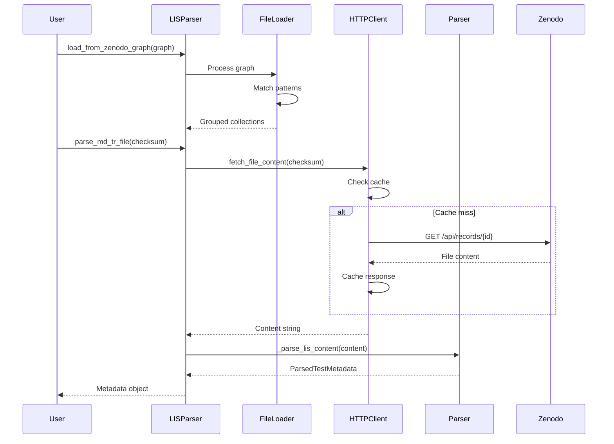

# BAM Creep-Reference Usecase

Parses LIS files from BAM creep test dataset and creates FDOs for materials science experiments.

## Overview

This usecase processes Laboratory Information System (LIS) files containing metadata about
creep tests on Ni-based superalloys. It extracts structured data and creates Material and
CreepExperiment FDOs following the FAIR principles.

## Architecture



## Component Responsibilities



## LIS File Format

### Naming Conventions

Two patterns are supported (Pattern B preferred):

| Pattern | Format | Example |
|---------|--------|---------|
| **Pattern A** | `Vh5205_C-XX-Type.LIS` | `Vh5205_C-78-MD-TR.lis` |
| **Pattern B** | `Vh5205_Type_C-XX.LIS` | `Vh5205_MD-TR_C-78.LIS` |
| **Standalone** | `Vh5205_C-XX.LIS` | `Vh5205_C-85.LIS` |

### File Types

| Type | Description | Required |
|------|-------------|----------|
| MD-TR | Master data - technical report | Yes |
| Creep | Creep test results | Yes |
| Loading | Loading procedure | Yes |

### Tab-Separated Format

```
CATEGORIZATION | ENTRY | ADDITIONAL_INFO | SYMBOL | UNIT | REQUIREMENT | INFORMATION | COMMON_TO_ALL
---------------|-------|-----------------|--------|------|-------------|-------------|--------------
Metadata --> Test info --> Test job details | Date of test start | | | | Mandatory | 2023-02-08 09:06:15 |
Metadata --> Test info --> Test parameters | Specified temperature | T | °C | Mandatory | 980 | *
```

## Usage

### Basic Usage

```python
import asyncio
from fdo_usecases.usecases.bam_creep_reference import LISParser

async def main():
    async with LISParser() as parser:
        # Load file information from Zenodo graph
        parser.load_from_zenodo_graph(zenodo_graph)

        # Parse individual test metadata
        metadata = await parser.parse_md_tr_file(checksum)
        print(f"Material: {metadata.material_id}")
        print(f"Temperature: {metadata.specified_temperature}°C")

        # Get grouped files
        collections = parser.group_files_by_test_id()

        # Report errors
        if parser.errors:
            for error in parser.errors:
                print(f"{error.test_id}: {error.error_type}")

asyncio.run(main())
```

### Complete Workflow

```python
from fdo_usecases.designs.zenodo import ZenodoFDODesign
from fdo_usecases.designs.creep import CreepFDOOrchestrator
from fdo_usecases.usecases.bam_creep_reference import LISParser

async def run_workflow():
    # Step 1: Create Zenodo FDOs
    zenodo_design = ZenodoFDODesign(dois=["10.5281/zenodo.20132712"])
    await zenodo_design.execute_async()

    # Step 2: Parse LIS files
    async with LISParser() as lis_parser:
        lis_parser.load_from_zenodo_graph(zenodo_design._record_graph)

        # Step 3: Create Creep FDOs
        creep_orchestrator = CreepFDOOrchestrator(zenodo_design._record_graph)
        await creep_orchestrator.execute_async(lis_parser)

        # Step 4: Apply inference rules
        creep_orchestrator._apply_inference_rules()
```

### Run Script

```bash
cd src/fdo_usecases/usecases/bam_creep_reference
python run.py
```

Output:
- `fdo_graph_merged.json` - Unified FDO graph
- Console statistics on parsed tests

## Testing

```bash
# Run all tests
pytest tests/usecases/bam_creep_reference/

# With coverage
pytest --cov=fdo_usecases.usecases.bam_creep_reference tests/usecases/bam_creep_reference/

# Specific test file
pytest tests/usecases/bam_creep_reference/test_parser.py
```

## Data Flow



## Troubleshooting

### Common Issues

**Rate Limiting (HTTP 429)**
- Automatic retry with exponential backoff
- Cache reduces repeated requests
- Wait time respects Retry-After header

**Missing Files**
- Incomplete test sets (missing MD-TR/Creep/Loading) are skipped
- Errors logged with test ID and missing file types
- Use `parser.report_errors()` to see all issues

**Date Parsing Failures**
- Multiple formats supported (ISO, US, European)
- Unparseable dates logged as warnings
- Test rejected if start/end dates missing

**No Material ID or Standard Found**
- These may be in MD-TR_Common-to-all.LIS instead of individual test files
- Call `await parser.get_common_metadata()` to retrieve shared metadata

## Code Structure

```
bam_creep_reference/
├── __init__.py              # Public API exports
├── models.py                # Data classes (~100 lines)
├── parser.py                # LIS content parsing (~250 lines)
├── file_loader.py           # Zenodo graph loading (~200 lines)
├── http_client.py           # HTTP fetching with caching (~100 lines)
├── image_extractor.py       # Image extraction (~80 lines)
├── dataset_metadata.py      # Dataset metadata (~60 lines)
├── lis_parser.py            # Facade (~150 lines)
└── README.md                # This file
```

## Related Documentation

- [Main Project README](../../../README.md)
- [Zenodo Design Documentation](../../designs/zenodo/README.md)
- [Creep Design Documentation](../../designs/creep/README.md)
