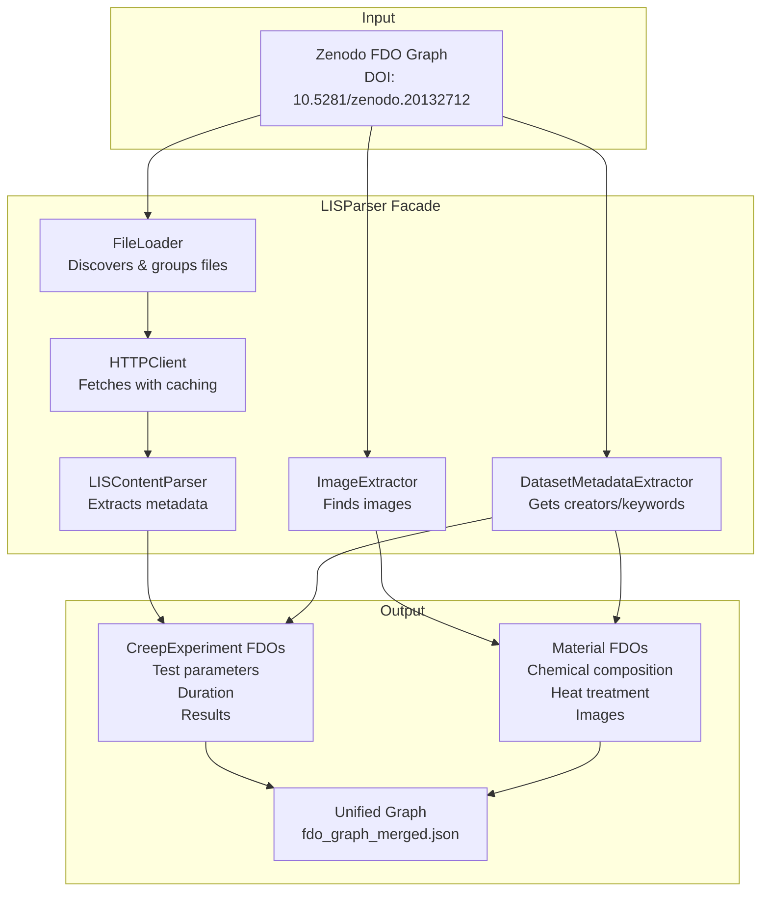
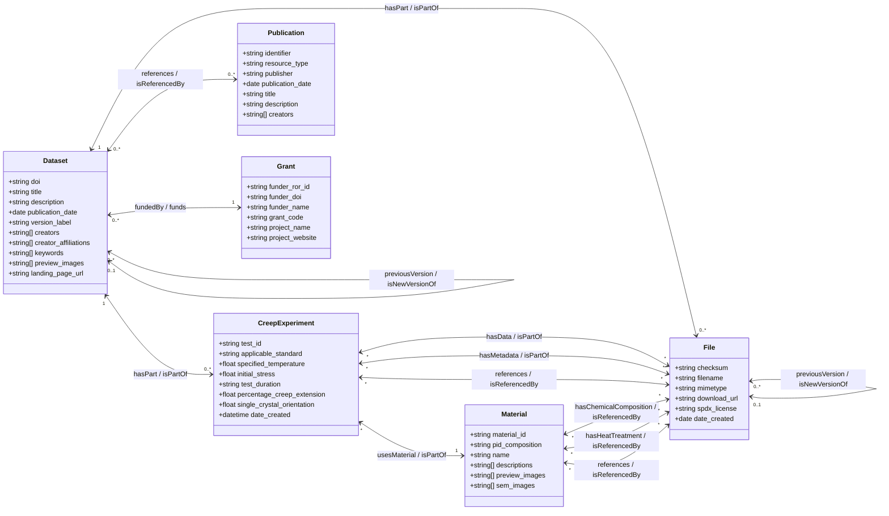
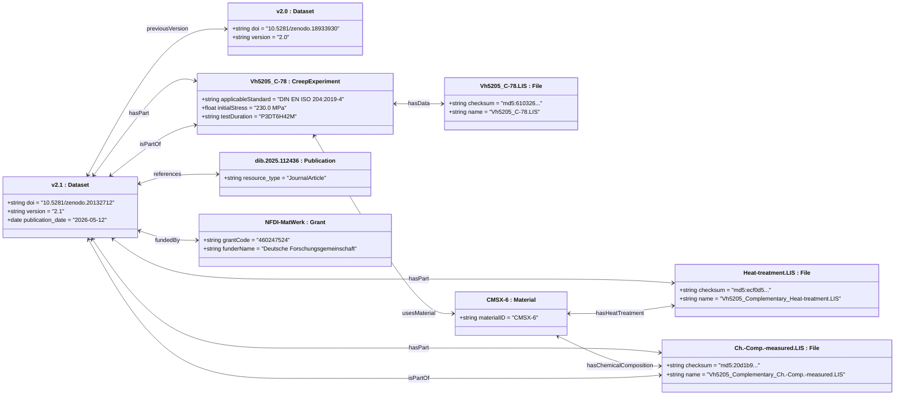
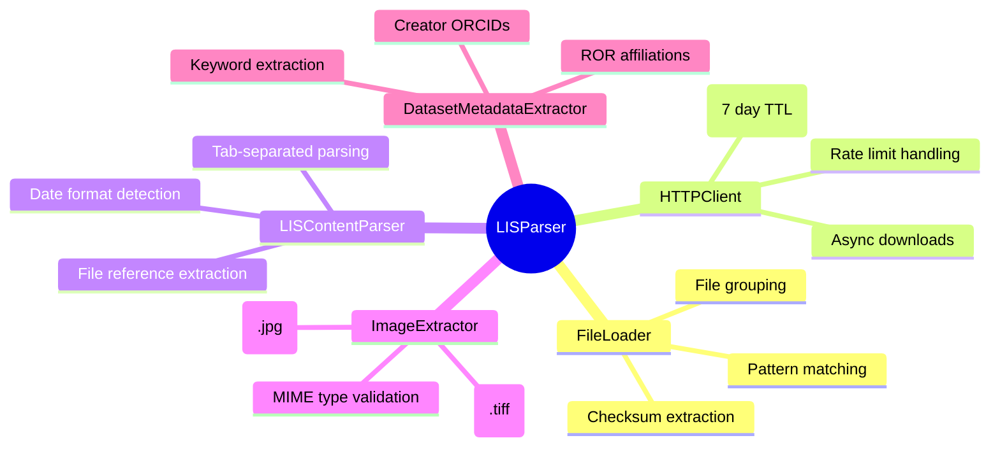
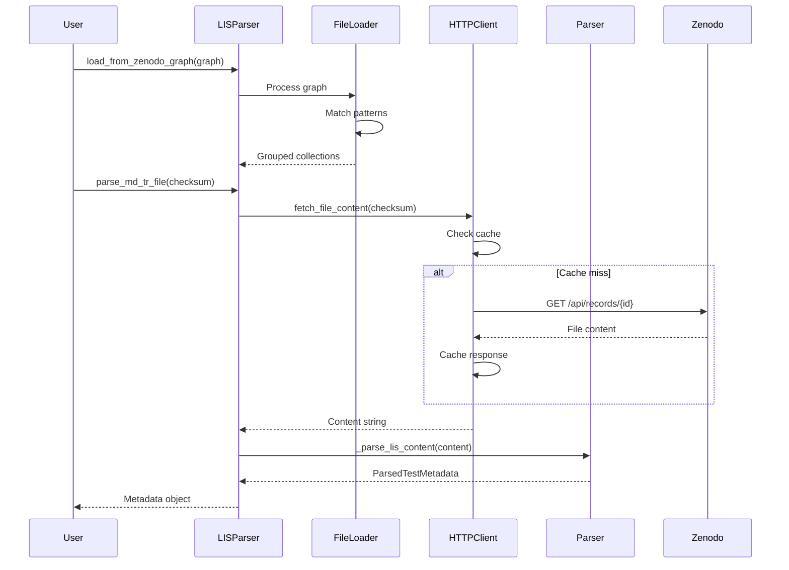

# BAM Creep-Reference Usecase

Parses LIS files from BAM creep test dataset and creates FDOs for materials science experiments.

## Overview

This usecase processes Laboratory Information System (LIS) files containing metadata about
creep tests on Ni-based superalloys. It extracts structured data and creates Material and
CreepExperiment FDOs following the FAIR principles.

## Architecture



## Domain Model

The use case is built around six domain classes, each of which is materialized
as a FAIR Digital Object (FDO) carrying one or more profiles (Base, Versionable,
DataResource, Publication, Grant, Creep, Material). The following **Mermaid
class diagram** shows the type-level structure of the domain: the classes, their
attributes, and the associations between them. Edge labels are written as
`forwardLink / backlink` because FDO relationships are bidirectional - the
backlink is inferred automatically when the FDOs are created.



While the class diagram describes the *schema* of the domain, the diagram below
shows a concrete *snapshot*: actual FDO instances from the dataset
`10.5281/zenodo.20132712` (BAM reference data for the single-crystal Ni-based
superalloy CMSX-6, version 2.1). Mermaid has no dedicated object-diagram type,
so the snapshot is drawn as a class diagram whose "classes" are the concrete
instances (labelled e.g. `v2.1 : Dataset`). Attribute values and links are
taken from `fdo_graph_merged.json`.



> Both diagrams render natively on GitHub. To export SVG/PNG for a paper, use
> the Mermaid CLI (`mmdc`), the Mermaid live editor (mermaid.live), or Kroki
> (kroki.io).

### Class Diagram vs. Object Diagram

| Aspect | Class Diagram | Object Diagram |
|--------|---------------|----------------|
| **Purpose** | Describes the type-level structure of the domain: which classes exist, their attributes, and how they are associated | Describes one concrete state: specific FDO instances, their attribute values, and the links actually present in the graph |
| **Abstraction** | High, dataset-independent; valid for every creep dataset processed by the use case | Low, dataset-specific; a snapshot that changes with each data release |
| **Elements** | Classes, typed attributes, associations with multiplicities | Objects (instances), concrete attribute values, links without multiplicities |
| **Size / stability** | Fixed number of elements, stable across datasets | Grows with the number of instances and changes over time |
| **Multiplicities** | Shown (`1`, `0..*`, `*`) | Not shown - each link is one concrete fact |
| **Best used for** | The paper's main domain model figure; schema documentation; API/design discussions | Explaining a concrete example, verifying a specific dataset, debugging the generated FDO graph |
| **Limitations** | Cannot show real attribute values or a concrete configuration | Cannot show the full schema, multiplicities, or constraints; becomes cluttered for large datasets |

## Component Responsibilities



## LIS File Format

### Naming Conventions

Two patterns are supported (Pattern B preferred):

| Pattern | Format | Example |
|---------|--------|---------|
| **Pattern A** | `Vh5205_C-XX-Type.LIS` | `Vh5205_C-78-MD-TR.lis` |
| **Pattern B** | `Vh5205_Type_C-XX.LIS` | `Vh5205_MD-TR_C-78.LIS` |
| **Standalone** | `Vh5205_C-XX.LIS` | `Vh5205_C-85.LIS` |

### File Types

| Type | Description | Required |
|------|-------------|----------|
| MD-TR | Master data - technical report | Yes |
| Creep | Creep test results | Yes |
| Loading | Loading procedure | Yes |

### Tab-Separated Format

```
CATEGORIZATION | ENTRY | ADDITIONAL_INFO | SYMBOL | UNIT | REQUIREMENT | INFORMATION | COMMON_TO_ALL
---------------|-------|-----------------|--------|------|-------------|-------------|--------------
Metadata --> Test info --> Test job details | Date of test start | | | | Mandatory | 2023-02-08 09:06:15 |
Metadata --> Test info --> Test parameters | Specified temperature | T | °C | Mandatory | 980 | *
```

## Usage

### Basic Usage

```python
import asyncio
from fdo_usecases.usecases.bam_creep_reference import LISParser

async def main():
    async with LISParser() as parser:
        # Load file information from Zenodo graph
        parser.load_from_zenodo_graph(zenodo_graph)

        # Parse individual test metadata
        metadata = await parser.parse_md_tr_file(checksum)
        print(f"Material: {metadata.material_id}")
        print(f"Temperature: {metadata.specified_temperature}°C")

        # Get grouped files
        collections = parser.group_files_by_test_id()

        # Report errors
        if parser.errors:
            for error in parser.errors:
                print(f"{error.test_id}: {error.error_type}")

asyncio.run(main())
```

### Complete Workflow

```python
from fdo_usecases.designs.zenodo import ZenodoFDODesign
from fdo_usecases.designs.creep import CreepFDOOrchestrator
from fdo_usecases.usecases.bam_creep_reference import LISParser

async def run_workflow():
    # Step 1: Create Zenodo FDOs
    zenodo_design = ZenodoFDODesign(dois=["10.5281/zenodo.20132712"])
    await zenodo_design.execute_async()

    # Step 2: Parse LIS files
    async with LISParser() as lis_parser:
        lis_parser.load_from_zenodo_graph(zenodo_design._record_graph)

        # Step 3: Create Creep FDOs
        creep_orchestrator = CreepFDOOrchestrator(zenodo_design._record_graph)
        await creep_orchestrator.execute_async(lis_parser)

        # Step 4: Apply inference rules
        creep_orchestrator._apply_inference_rules()
```

### Run Script

```bash
cd src/fdo_usecases/usecases/bam_creep_reference
python run.py
```

Output:
- `fdo_graph_merged.json` - Unified FDO graph
- Console statistics on parsed tests
- If Elasticsearch is configured (see below): sync artifacts for the Elasticsearch / Typed PID Maker step

## Elasticsearch / Typed PID Maker Sync

`run.py` has a final step that compares the freshly built graph against the FDOs
already published in a remote Elasticsearch index and keeps the Typed PID Maker
in sync with the latest state of the graph.

How it works:

1. **Compare** - Every record is matched to the index by its *placeholder PID*.
   Placeholder PIDs are prefixed with `PID_` (e.g. `PID_10.5281/zenodo.20132712`,
   `PID_md5:...`, `PID_Vh5205_C-89`) so they can never be confused with literal
   attribute values such as a file's checksum. If the index is missing or empty,
   the comparison is skipped and every record is treated as new.
2. **Create** - Records that do not exist yet are sent to the Typed PID Maker's
   batch endpoint (`POST /api/v1/pit/pids`). The service replaces the `PID_`
   placeholders with real Handle PIDs and returns a placeholder-to-PID mapping.
3. **Update** - Records that already exist but whose content changed are updated
   via `PUT /api/v1/pit/pid/{pid}` with the `If-Match` ETag; references to other
   FDOs are fixed to their real Handle PIDs first.
4. **Export** - The complete graph is written out with real Handle PIDs, ready
   to be ingested into Elasticsearch.

The Typed PID Maker is **only contacted** when `FDO_ES_BASE_URL` and
`FDO_ES_INDEX` are set (otherwise the whole sync step is skipped) and
`FDO_SYNC_DRYRUN` is not `1` (in dry-run mode all artifacts are written but
nothing is created or updated). The logs state explicitly whether the Typed PID
Maker was involved and how many FDOs were created or updated.

Output files (written next to `fdo_graph_merged.json`):

| File | Meaning |
|------|---------|
| `bulk_create.json` | Payload for the Typed PID Maker batch endpoint: the new FDOs as SimpleJSON records with `PID_` placeholders. |
| `updates.json` | Human-readable list of changes detected for existing FDOs (before PID resolution), including the changed attribute keys. |
| `mapping.json` | Placeholder PID -> real Handle PID mapping after creation (only written when FDOs were actually created). |
| `updates_resolved.json` | Final update payloads with placeholder PIDs fixed to real Handle PIDs, ready for `PUT /api/v1/pit/pid/{pid}`. |
| `fdo_graph_es_ingest.json` | The full graph as Elasticsearch documents (`{"pid": ..., "<infoTypePID>": [...]}`) with real Handle PIDs - ingest this into the index. |
| `sync_summary.json` | Machine-readable summary: counts of new/changed/unchanged records, dry-run flag, and the full mapping. |

Configuration (via `.env` or environment variables):

| Variable | Purpose |
|----------|---------|
| `FDO_ES_BASE_URL` | Elasticsearch base URL (e.g. `https://.../es_proxy`). Required to enable the sync step. |
| `FDO_ES_INDEX` | Elasticsearch index name. Required to enable the sync step. |
| `FDO_ES_API_KEY` | Elasticsearch API key (`Authorization: ApiKey ...`). |
| `FDO_ES_USERNAME` / `FDO_ES_PASSWORD` | Alternative basic authentication for Elasticsearch. |
| `FDO_TPM_HOST` | Typed PID Maker base URL (default `http://typed-pid-maker.datamanager.kit.edu/preview`). |
| `FDO_TPM_API_KEY` | Optional bearer token for the Typed PID Maker. |
| `FDO_SYNC_DRYRUN` | Set to `1` to only write the JSON artifacts without contacting the Typed PID Maker. |

## Testing

```bash
# Run all tests
pytest tests/usecases/bam_creep_reference/

# With coverage
pytest --cov=fdo_usecases.usecases.bam_creep_reference tests/usecases/bam_creep_reference/

# Specific test file
pytest tests/usecases/bam_creep_reference/test_parser.py
```

## Data Flow



## Troubleshooting

### Common Issues

**Rate Limiting (HTTP 429)**
- Automatic retry with exponential backoff
- Cache reduces repeated requests
- Wait time respects Retry-After header

**Missing Files**
- Incomplete test sets (missing MD-TR/Creep/Loading) are skipped
- Errors logged with test ID and missing file types
- Use `parser.report_errors()` to see all issues

**Date Parsing Failures**
- Multiple formats supported (ISO, US, European)
- Unparseable dates logged as warnings
- Test rejected if start/end dates missing

**No Material ID or Standard Found**
- These may be in MD-TR_Common-to-all.LIS instead of individual test files
- Call `await parser.get_common_metadata()` to retrieve shared metadata

## Code Structure

```
bam_creep_reference/
├── __init__.py              # Public API exports
├── models.py                # Data classes (~100 lines)
├── parser.py                # LIS content parsing (~250 lines)
├── file_loader.py           # Zenodo graph loading (~200 lines)
├── http_client.py           # HTTP fetching with caching (~100 lines)
├── image_extractor.py       # Image extraction (~80 lines)
├── dataset_metadata.py      # Dataset metadata (~60 lines)
├── lis_parser.py            # Facade (~150 lines)
├── sync.py                  # Elasticsearch comparison + Typed PID Maker sync
└── README.md                # This file
```

## Related Documentation

- [Main Project README](../../../README.md)
- [Zenodo Design Documentation](../../designs/zenodo/README.md)
- [Creep Design Documentation](../../designs/creep/README.md)
